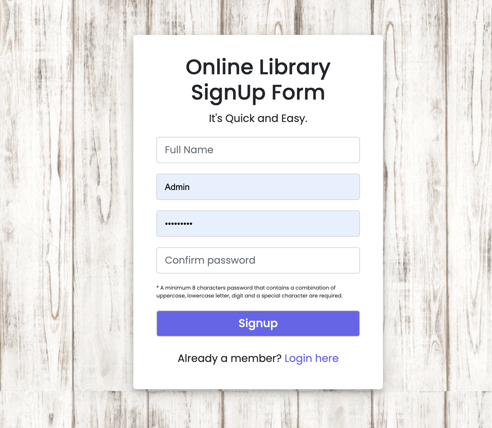
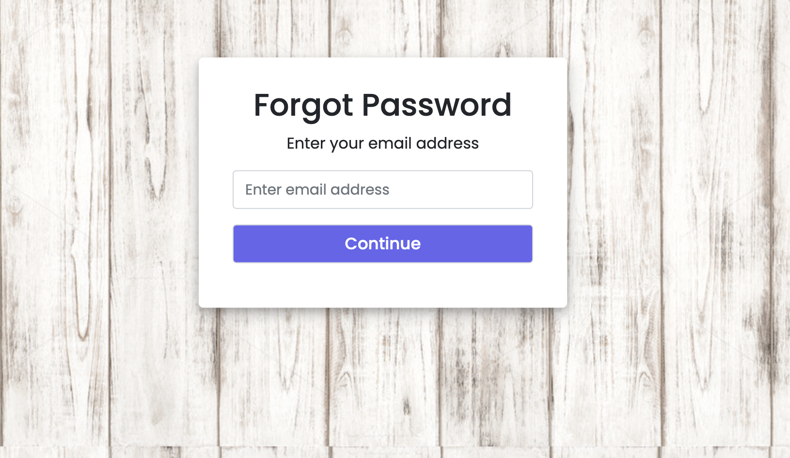
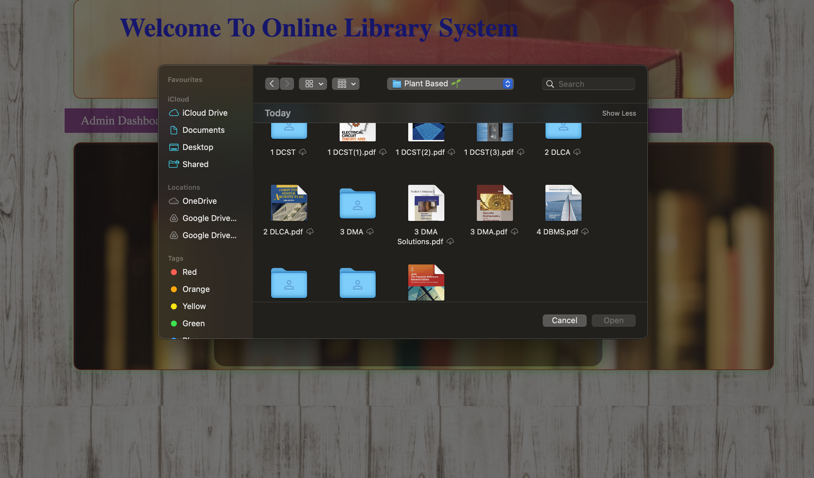

# MiniProject-Sem-III Online Library
Done By B Anuraag and DV Dheeraj

Front-End (HTML, CSS, Bootstrap)

Back-End (PHP)

Database(MariaDB/MySQL)

Server (XAMPP)

1st Step: Extract file

2nd Step: Copy the main project folder

3rd Step: Paste in xampp/htdocs/

4th Step: Open a browser and go to URL “http://localhost/phpmyadmin/”

5th Step: Then, click on the databases tab

6th Step: Create a database naming “lib” and then click on the import tab

7th Step: Click on browse file and select “lib.sql” file which is inside the “sql field” folder

8th Step: Click on go.

After Creating Database,

9th Step: Open a browser and go to URL “http://localhost/Library-Management-System/”

Note: For the admin page, go to URL “http://localhost/Library-Management-System/admin.php”

